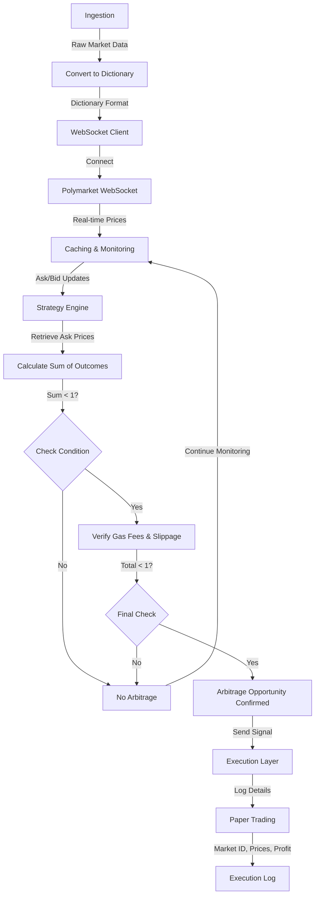

# Design Document: Polymarket Risk-Free Arbitrage System (V1.0 MVP)

Author: Alan Liang

Date: 2026-03-11

Status: Approved

## 1. Context

Prediction markets like Polymarket operate 24/7, pricing mutually exclusive events based on crowd consensus. However, due to market inefficiencies, information asymmetry, or temporary emotional trading, the sum of implied probabilities (prices) for all mutually exclusive outcomes in a specific market may temporarily fall below 100% (or $1.00).

This project aims to build an automated, event-driven trading pipeline capable of digesting real-time Central Limit Order Book (CLOB) data, identifying these transient mispricings, and calculating potential risk-free arbitrage opportunities.

## 2. Objective & Non-Objective

Goals:

Reliable Data Ingestion: Establish a robust, fault-tolerant WebSocket connection to the Polymarket API to stream real-time orderbook snapshots and delta updates.

Algorithmic Strategy Execution: Accurately implement the arbitrage mathematical logic (Sum of Best Asks < $1.00 - Total Fees) to detect actionable signals.

Paper Trading & Auditing: Implement a highly observable logging system to record detected opportunities (timestamps, prices, expected PnL) without executing real capital.

Non-Goals:

No Real Capital Execution: We will not integrate live wallet signing or smart contract execution in V1.0 to eliminate the risk of financial loss during edge cases.

No Premature Optimization: Ultra-low latency optimization (e.g., C++ integration or kernel-level networking) is deferred to future iterations.

No Complex UI/DB: Real-time dashboards or persistent database storage (PostgreSQL/Redis) are out of scope for the MVP.

## 3. System Architecture

The MVP will be implemented entirely in Python using an asynchronous, decoupled architecture consisting of three main components:

Data Ingestion Layer (WebSocket Client): Subscribes to the Polymarket API, maintains the connection heartbeat, and parses raw JSON payloads.

Strategy Engine: Receives parsed orderbook states, extracts the Best Bid/Ask, and computes the sum of mutually exclusive outcomes.

Execution & Logging Layer: Triggers the paper trading routine when an arbitrage condition is met and outputs formatted logs.

## 4. Detailed Design

### 4.1 Data Ingestion (WebSocket Client)

Libraries: We will utilize Python's built-in asyncio for asynchronous I/O and the websockets library for connection handling.

Keep-Alive Mechanism: A background async task will be spawned to send a "PING" control frame every 10 seconds to prevent the server from terminating the idle connection.

Data Schema Parsing: The module will parse the incoming JSON, specifically targeting the bids and asks arrays to extract the price and size string values.

### 4.2 Strategy Engine (Arbitrage Logic)

Trigger Condition: For a given market with N mutually exclusive outcomes, the system triggers a signal when: Sum(Best Ask of Outcome i) < 1.00

Fee Consideration: Polymarket may charge maker/taker fees. The true trigger formula must be updated to ensure the spread covers the transaction cost: Sum(Best Asks) + Estimated Fees < 1.00.

### 4.3 Execution & Logging

Log Format: Upon detecting a signal, the system will output an info-level log:
[YYYY-MM-DD HH:MM:SS] | Market: <Market_ID> | Type: <Market_Type> | Cost: $<Total_Cost> | Expected Profit: $<Risk_Free_Profit>

## 5. Alternatives Considered

Alternative 1: Using REST API Polling instead of WebSockets

Why we rejected it: Polling requires repeatedly sending HTTP requests (e.g., once per second). This leads to severe rate-limiting issues (HTTP 429) and high latency. WebSockets provide a persistent, push-based stream, which is the industry standard for real-time market data.

Alternative 2: Building the Core Engine in C++ immediately

Why we rejected it: Premature optimization. Building the network layer and JSON parsing in C++ introduces high development overhead. Python allows for rapid prototyping to verify the core arbitrage logic first. C++ will be considered for V2.0 if Python's Global Interpreter Lock (GIL) or processing latency becomes the proven bottleneck.

## 6. Testing Plan

Unit Testing: We will inject mock JSON payloads into the Strategy Engine.

Test Case A: Inject an orderbook where Sum(Asks) = 0.95 -> Assert that the trading signal returns True.

Test Case B: Inject an orderbook where Sum(Asks) = 1.05 -> Assert that the trading signal returns False.

Integration Testing (Soak Test): Run the WebSocket client connected to the live Polymarket production server for 24 hours continuously to verify that the Keep-Alive mechanism works and the system can gracefully handle unexpected disconnections (reconnect logic).

## 7. Workflow

### 1. Ingestion
 - Fetch data from the API and store the raw market information.
 - Convert the market information into a dictionary format.

### 2. WebSocket Connection
 - Pass the dictionary to the WebSocket client.
 - Connect to Polymarket using WebSockets and subscribe to real-time ask and bid prices.

### 3. Caching & Monitoring
 - Cache the incoming ask and bid data from the WebSocket flow and continuously keep the data updated.

### 4. Strategy Engine
 - Retrieve the latest ask prices for the mutually exclusive outcomes and calculate their sum.
 - If the sum is less than 1, verify that adding estimated gas fees and slippage still keeps the total cost below 1. If it does, an arbitrage opportunity is confirmed—send the signal to the execution layer.

### 5. Paper Trading (MVP Version)
 - Log the execution details: Market ID, triggered prices, and expected profit.

